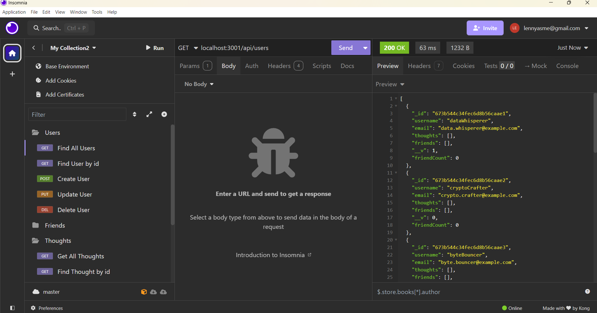
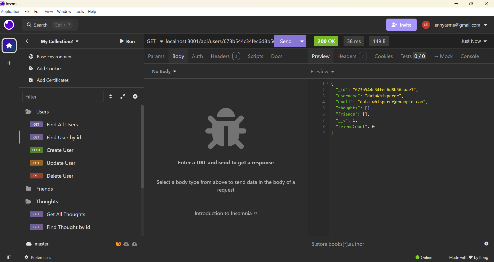
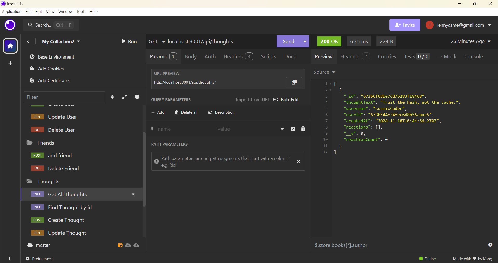
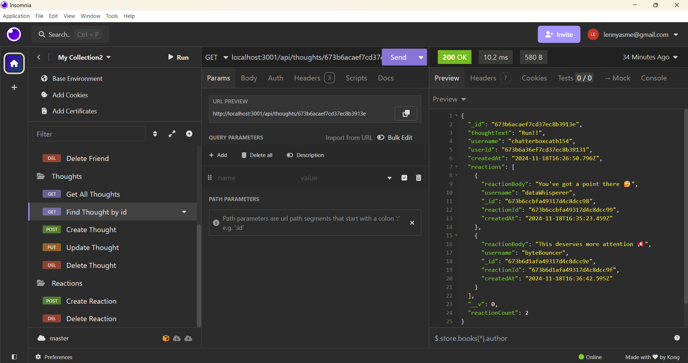
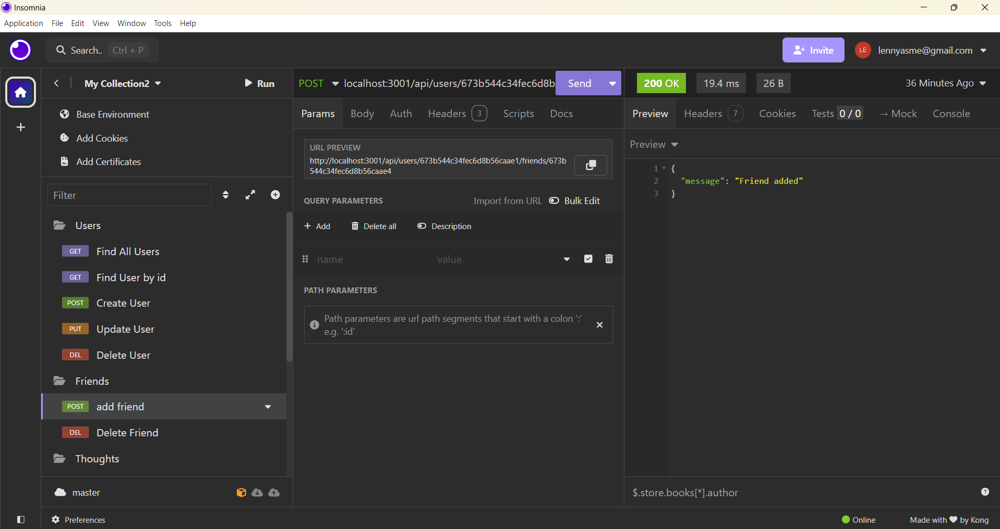
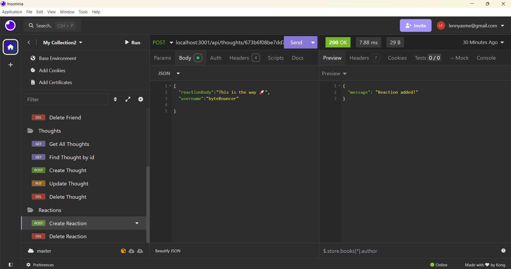

# mylinkies

## Basic Overview

mylinkies is a severAPI that will be used for a social network web application where users can share their thoughts, react to friends' thoughts, and create a friend list. The serverAPI uses Express.js for routing, a MongoDB database, and the Mongoose ODM. In addition to using the Express.js and Mongoose packages, it uses  the native JavaScript Date object to format timestamps.connects to the server database using MongoDB. 

## API Usage

The mylinkies uses two models, and two schemas, with one of the models havibg a submodel called the reaction:
    
### Models
    * User
    * Thoughts
### Schema
    *User 
    *Thoughts (the user's thoughts)
        -Reaction (other users' thoughts on main user's thoughts)

## Walkthrough
The [Video Link](https://drive.google.com/file/d/1SV0rttO6iN69uzQqz0WLZd3XlWgoRNmS/view?usp=sharing) and screenshots below will show you the API route using Insomnia

[Slower video version here](https://drive.google.com/file/d/1FLkMtP-2PhpTwHJh78jFC7dWSm1md1wM/view?usp=sharing)

### Screenshots
Users

FInd a single user

Get All Thoughts

Find a single thought

Add a friend

Add a reaction

## Contribution
No monetay contribution but will always accept critics and improvement options 

## Future Development
For future development, the serverAPI will but used in another project (Undetermined). 

##
Note: I received help from BCS Learning assistant (to clarify my errors) and tutors. 

© 2024 lenworth425 Confidential and Proprietary. All Rights Reserved.